# Data Flow Diagrams - PharmaBot (Mermaid Format)

## Level 0 DFD (Context Diagram)

```mermaid
graph TB
    User[("👤 User<br/>(Patient)")]
    ESP32[("🔌 ESP32 IoT<br/>Device")]
    Gemini[("🤖 Google Gemini<br/>AI Service")]
    WiFi[("📡 WiFi<br/>Network")]
    
    System["PharmaBot<br/>Medication Management<br/>System"]
    
    User -->|"• Prescription Images<br/>• Authentication<br/>• Manual Commands<br/>• Schedule Management"| System
    System -->|"• Dashboard Stats<br/>• Schedules<br/>• Adherence Reports<br/>• Device Status"| User
    
    ESP32 -->|"• Hardware State<br/>• Dispense Confirmations<br/>• Heartbeat Signals<br/>• Sensor Data"| System
    System -->|"• Dispense Commands<br/>• Schedule Updates<br/>• Configuration"| ESP32
    
    System -->|"Prescription Images"| Gemini
    Gemini -->|"Structured Data<br/>(medicines, dosages)"| System
    
    WiFi -.->|"Network Infrastructure"| System
    WiFi -.->|"Network Infrastructure"| ESP32
    
    style System fill:#4A90E2,stroke:#2E5C8A,stroke-width:3px,color:#fff
    style User fill:#27AE60,stroke:#1E8449,stroke-width:2px,color:#fff
    style ESP32 fill:#E67E22,stroke:#BA6610,stroke-width:2px,color:#fff
    style Gemini fill:#9B59B6,stroke:#7D3C98,stroke-width:2px,color:#fff
    style WiFi fill:#95A5A6,stroke:#6C7A7C,stroke-width:2px,color:#fff
```

---

## Level 1 DFD (Major Processes)

```mermaid
graph TB
    User[("👤 User<br/>(Patient)")]
    ESP32[("🔌 ESP32 IoT<br/>Device")]
    Gemini[("🤖 Google Gemini<br/>AI")]
    
    subgraph Processes["Core System Processes"]
        P1["1.0<br/>User<br/>Authentication"]
        P2["2.0<br/>Prescription<br/>Management"]
        P3["3.0<br/>Schedule<br/>Management"]
        P4["4.0<br/>Device Control<br/>& Management"]
        P5["5.0<br/>AI Parsing<br/>Service"]
        P6["6.0<br/>Dispense<br/>Logic"]
    end
    
    subgraph DataStores["Data Stores"]
        D1[("D1: User Database<br/>Users | Prescriptions | Medicines")]
        D2[("D2: Device State<br/>IoT_Device | hardware_state")]
        D3[("D3: Schedules<br/>Schedule entries")]
        D4[("D4: Hardware State<br/>JSON state data")]
    end
    
    User -->|"Login/Register"| P1
    User -->|"Upload Image"| P2
    User -->|"Manage Schedules"| P3
    User -->|"Manual Commands"| P6
    
    P1 <-->|"User Data"| D1
    P2 <-->|"Prescriptions<br/>Medicines"| D1
    P3 <-->|"Medicines"| D1
    P3 <-->|"Schedules"| D3
    
    P2 -->|"Image"| P5
    P5 -->|"Parsed Data"| P2
    P5 <-.->|"API Call"| Gemini
    
    P4 <-->|"Device Info<br/>Commands"| D2
    P4 <-->|"Hardware State"| D4
    P6 -->|"Dispense Commands"| D2
    P6 <-->|"Schedule Status"| D3
    
    ESP32 <-->|"State Updates<br/>Commands<br/>Heartbeat"| P4
    ESP32 -->|"Confirmations"| P6
    
    P1 -->|"Session"| User
    P3 -->|"Schedules"| User
    P6 -->|"Status"| User
    
    style P1 fill:#3498DB,stroke:#2874A6,stroke-width:2px,color:#fff
    style P2 fill:#1ABC9C,stroke:#16A085,stroke-width:2px,color:#fff
    style P3 fill:#9B59B6,stroke:#7D3C98,stroke-width:2px,color:#fff
    style P4 fill:#E67E22,stroke:#CA6F1E,stroke-width:2px,color:#fff
    style P5 fill:#E74C3C,stroke:#C0392B,stroke-width:2px,color:#fff
    style P6 fill:#F39C12,stroke:#D68910,stroke-width:2px,color:#fff
    
    style D1 fill:#5DADE2,stroke:#2874A6,stroke-width:2px,color:#fff
    style D2 fill:#58D68D,stroke:#28B463,stroke-width:2px,color:#fff
    style D3 fill:#AF7AC5,stroke:#7D3C98,stroke-width:2px,color:#fff
    style D4 fill:#F8C471,stroke:#D68910,stroke-width:2px,color:#fff
```

---

## Detailed Flow: Prescription Upload

---

## Detailed Flow: Manual Dispense

---

## Detailed Flow: Automated Schedule Dispense

```mermaid
sequenceDiagram
    participant Clock as Time Scheduler
    participant P3 as Process 3.0<br/>Schedule Mgmt
    participant D3 as D3: Schedules
    participant P6 as Process 6.0<br/>Dispense Logic
    participant D1 as D1: Medicines
    participant D2 as D2: Device State
    participant ESP32 as ESP32 Device
    participant P4 as Process 4.0<br/>Device Control
    participant User as User
    
    loop Every 30 seconds
        Clock->>P3: Check for due schedules
        P3->>D3: Query schedules where<br/>scheduled_time <= now<br/>AND taken = false
        
        alt Schedule found
            D3-->>P3: Return due schedule(s)
            
            P3->>P6: Trigger dispense
            P6->>D1: Get medicine & compartment
            D1-->>P6: Medicine data
            P6->>D1: Parse frequency → dosage count
            
            rect rgb(240, 255, 255)
                Note over P6,D2: Command Queue
                P6->>P6: Create automated dispense command
                P6->>D2: Add to pending_commands
            end
            
            ESP32->>P4: Poll for commands
            P4->>D2: Retrieve pending_commands
            D2-->>P4: Command array
            P4-->>ESP32: Send commands
            P4->>D2: Clear commands
            
            rect rgb(255, 250, 240)
                Note over ESP32: Dispense
                ESP32->>ESP32: Play alert (medication time!)
                ESP32->>ESP32: Display medicine name on LCD
                ESP32->>ESP32: Execute servo rotation
                ESP32->>ESP32: Play success sound
            end
            
            ESP32->>P6: Dispense confirmation
            P6->>D3: Mark schedule.taken = true<br/>Set taken_at timestamp
            D3-->>P6: Updated
            
            P6-->>User: Notification (optional)
        end
    end
```

---

## Detailed Flow: Device State Synchronization

---

## Detailed Flow: Schedule Regeneration (Bulk)

```mermaid
sequenceDiagram
    actor User
    participant UI as Web Interface
    participant P3 as Process 3.0<br/>Schedule Mgmt
    participant D1 as D1: Database
    participant D3 as D3: Schedules
    
    User->>UI: Click "Regenerate All Schedules"
    UI->>UI: Show modal with date picker
    User->>UI: Select start date (default: today)
    UI->>P3: POST /api/prescription/{id}/regenerate-all-schedules<br/>{start_date: "2025-12-10"}
    
    P3->>D1: Get prescription details
    D1-->>P3: Prescription data
    
    P3->>D1: Get all active medicines<br/>in this prescription
    D1-->>P3: [Medicine1, Medicine2, Medicine3, ...]
    
    loop For each medicine
        rect rgb(255, 240, 240)
            Note over P3,D3: Clean Old Data
            P3->>D3: DELETE schedules WHERE<br/>medicine_id = {id}<br/>AND scheduled_time >= start_date
            D3-->>P3: Deleted count
        end
        
        rect rgb(240, 255, 240)
            Note over P3: Generate New Schedules
            P3->>P3: Parse frequency (e.g., "1+0+1")
            Note over P3: Morning: 1, Afternoon: 0, Evening: 1
            
            P3->>P3: Parse duration (e.g., "30 days")
            P3->>P3: Calculate end_date = start_date + 30
            
            loop For each day in range
                P3->>P3: If morning_count > 0<br/>→ Create schedule at 08:00
                P3->>P3: If afternoon_count > 0<br/>→ Create schedule at 14:00
                P3->>P3: If evening_count > 0<br/>→ Create schedule at 20:00
                
                P3->>D3: INSERT schedule entries
            end
        end
        
        P3->>D1: Update medicine.dose_start_date
        D1-->>P3: Updated
    end
    
    P3-->>UI: Success<br/>{total_schedules: 180,<br/>medicines: [{name, count}, ...]}
    UI->>UI: Show success modal with details
    UI->>UI: Reload page
    UI-->>User: Display updated schedules
```

---

## System Architecture Overview

```mermaid
graph TB
    subgraph Client["Client Layer"]
        Browser["🌐 Web Browser<br/>(Chrome/Firefox/Safari)"]
        Mobile["📱 Mobile View<br/>(Responsive UI)"]
    end
    
    subgraph Backend["Application Layer (Flask)"]
        WebRoutes["🔗 Web Routes<br/>(main.py)<br/>HTML Pages"]
        APIRoutes["🔌 API Routes<br/>(routes.py)<br/>REST Endpoints"]
        Services["⚙️ Services<br/>(gemini_service.py)<br/>Business Logic"]
        IoTManager["🤖 IoT Manager<br/>(esp32_manager.py)<br/>Device Control"]
    end
    
    subgraph Data["Data Layer"]
        SQLite["💾 SQLite Database<br/>Users | Prescriptions<br/>Medicines | Schedules<br/>IoT_Device"]
        FileStorage["📁 File Storage<br/>Prescription Images<br/>uploads/prescriptions/"]
    end
    
    subgraph Hardware["Hardware Layer"]
        ESP32Board["🔧 ESP32 Board<br/>WiFi | NTP | HTTP Client"]
        Servos["⚙️ 3× Servo Motors<br/>Compartments 1-3"]
        Ultrasonic["📏 Ultrasonic Sensor<br/>Medicine Detection"]
        Buzzer["🔔 Buzzer<br/>Alerts & Notifications"]
        LED["💡 LED Indicator<br/>Status Display"]
        LCD["📺 16×2 LCD<br/>User Interface"]
    end
    
    subgraph External["External Services"]
        GeminiAPI["🤖 Google Gemini API<br/>Vision AI<br/>Prescription Parsing"]
        NTP["🕐 NTP Server<br/>Time Synchronization"]
    end
    
    Browser <-->|HTTPS| WebRoutes
    Mobile <-->|HTTPS| WebRoutes
    WebRoutes <--> APIRoutes
    APIRoutes <--> Services
    APIRoutes <--> IoTManager
    
    Services <-->|Read/Write| SQLite
    APIRoutes <-->|Read/Write| SQLite
    WebRoutes <-->|Read/Write| SQLite
    
    Services -->|Save Images| FileStorage
    Services <-->|API Call| GeminiAPI
    
    ESP32Board <-->|HTTP Polling| IoTManager
    ESP32Board <-->|NTP Sync| NTP
    
    ESP32Board -->|Control| Servos
    ESP32Board -->|Read| Ultrasonic
    ESP32Board -->|Control| Buzzer
    ESP32Board -->|Control| LED
    ESP32Board -->|Display| LCD
    
    style Browser fill:#3498DB,stroke:#2874A6,color:#fff
    style Mobile fill:#1ABC9C,stroke:#16A085,color:#fff
    style WebRoutes fill:#9B59B6,stroke:#7D3C98,color:#fff
    style APIRoutes fill:#E67E22,stroke:#CA6F1E,color:#fff
    style Services fill:#E74C3C,stroke:#C0392B,color:#fff
    style IoTManager fill:#F39C12,stroke:#D68910,color:#fff
    style SQLite fill:#5DADE2,stroke:#2874A6,color:#fff
    style FileStorage fill:#58D68D,stroke:#28B463,color:#fff
    style ESP32Board fill:#34495E,stroke:#1C2833,color:#fff
    style Servos fill:#95A5A6,stroke:#6C7A7C,color:#fff
    style Ultrasonic fill:#95A5A6,stroke:#6C7A7C,color:#fff
    style Buzzer fill:#95A5A6,stroke:#6C7A7C,color:#fff
    style LED fill:#95A5A6,stroke:#6C7A7C,color:#fff
    style LCD fill:#95A5A6,stroke:#6C7A7C,color:#fff
    style GeminiAPI fill:#AF7AC5,stroke:#7D3C98,color:#fff
    style NTP fill:#85C1E9,stroke:#5499C7,color:#fff
```

---

## Database Entity Relationship

---

**Generated for**: PharmaBot Medication Management System  
**Date**: December 10, 2025  
**Format**: Mermaid Diagrams  
**Compatible with**: GitHub, GitLab, Notion, Obsidian, VS Code (with Mermaid extension)
